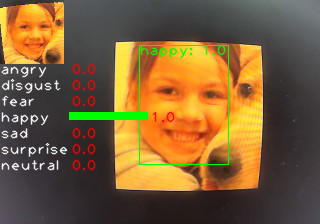
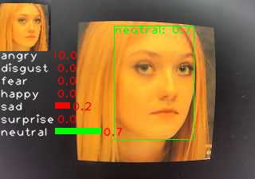

## Introduction

In the previous articles, [Facial Detection and Keypoint Detection](./face_detection.md) and [Facial Multi-Keypoint Detection], we introduced how to detect faces, keypoints, and facial recognition. This article focuses on recognizing facial emotions (expressions). It also explores how to identify other characteristics, such as gender, mask-wearing, and age.

 

Demonstration video on MaixCAM:
<video playsinline controls autoplay loop muted preload src="/static/video/maixcam_face_emotion.mp4" type="video/mp4">
Classifier Result video
</video>

> Video source: [oarriaga/face_classification](https://github.com/oarriaga/face_classification)

## Using Facial Emotion Recognition in MaixCAM MaixPy

MaixPy provides a default emotion recognition model with seven categories:
* angry
* disgust
* fear
* happy
* sad
* surprise
* neutral

The process for emotion recognition involves several steps:
1. Detect the face.
2. Crop the face into a standard format, as shown in the small image in the top-left corner above.
3. Classify the cropped face image using a simple model.

In MaixPy, the `yolov8-face` model is used for detecting facial and eye positions, followed by classification. Below is the code, which is also available in the [MaixPy](https://github.com/sipeed/maixpy) `examples` directory:

```python
from maix import camera, display, image, nn, app

detect_conf_th = 0.5
detect_iou_th = 0.45
emotion_conf_th = 0.5
max_face_num = -1
crop_scale = 0.9

# detect face model
detector = nn.YOLOv8(model="/root/models/yolov8n_face.mud", dual_buff=False)
# landmarks detector for cropping images
landmarks_detector = nn.FaceLandmarks(model="")
# emotion classify model
classifier = nn.Classifier(model="/root/models/face_emotion.mud", dual_buff=False)

cam = camera.Camera(detector.input_width(), detector.input_height(), detector.input_format())
disp = display.Display()

# for drawing result info
max_labels_length = 0
for label in classifier.labels:
    size = image.string_size(label)
    if size.width() > max_labels_length:
        max_labels_length = size.width()

max_score_length = cam.width() / 4

while not app.need_exit():
    img = cam.read()
    results = []
    objs = detector.detect(img, conf_th=detect_conf_th, iou_th=detect_iou_th, sort=1)
    count = 0
    idxes = []
    img_std_first: image.Image = None
    for i, obj in enumerate(objs):
        img_std = landmarks_detector.crop_image(img, obj.x, obj.y, obj.w, obj.h, obj.points,
                                                classifier.input_width(), classifier.input_height(), crop_scale)
        if img_std:
            img_std_gray = img_std.to_format(image.Format.FMT_GRAYSCALE)
            res = classifier.classify(img_std_gray, softmax=True)
            results.append(res)
            idxes.append(i)
            if i == 0:
                img_std_first = img_std
            count += 1
            if max_face_num > 0 and count >= max_face_num:
                break
    for i, res in enumerate(results):
        if i == 0:
            img.draw_image(0, 0, img_std_first)
            for j in range(len(classifier.labels)):
                idx = res[j][0]
                score = res[j][1]
                img.draw_string(0, img_std_first.height() + idx * 16, classifier.labels[idx], image.COLOR_WHITE)
                img.draw_rect(max_labels_length, int(img_std_first.height() + idx * 16), int(score * max_score_length), 8, image.COLOR_GREEN if score >= emotion_conf_th else image.COLOR_RED, -1)
                img.draw_string(int(max_labels_length + score * max_score_length + 2), int(img_std_first.height() + idx * 16), f"{score:.1f}", image.COLOR_RED)
        color = image.COLOR_GREEN if res[0][1] >= emotion_conf_th else image.COLOR_RED
        obj = objs[idxes[i]]
        img.draw_rect(obj.x, obj.y, obj.w, obj.h, color, 1)
        img.draw_string(obj.x, obj.y, f"{classifier.labels[res[0][0]]}: {res[0][1]:.1f}", color)
    disp.show(img)
```

### Key Code

The core code steps are as follows:
```python
objs = detector.detect(img, conf_th=detect_conf_th, iou_th=detect_iou_th, sort=1)
img_std = landmarks_detector.crop_image(...)
img_std_gray = img_std.to_format(image.Format.FMT_GRAYSCALE)
res = classifier.classify(img_std_gray, softmax=True)
```

These correspond to:
1. Detect the face.
2. Crop the face.
3. Classify the face image using a model (convert to grayscale before input as required).

## Improving Recognition Accuracy

The default MaixPy model offers basic classification but can be optimized by:
* **Using keypoints as model input:** Instead of cropped images, facial keypoints can be used for input, removing background interference and improving training accuracy.
* **Enhancing datasets:** Increase the number and variety of samples.
* **Improving cropping techniques:** Use advanced transformations for precise cropping, such as affine transformations commonly used in facial recognition.

## Training a Custom Classification Model

### Overview
1. **Define categories:** E.g., 7 emotions, gender, mask detection, etc.
2. **Choose a model:** Lightweight classification models like MobileNetV2 work well.
3. **Select a training platform:**
   * Use [MaixHub](https://maixhub.com) for online training (**recommended**).
   * Alternatively, train locally using PyTorch or TensorFlow.
4. **Collect data:** Modify the code to save captured images, e.g., `img.save("/root/image0.jpg")`.
5. **Clean data:** Organize samples into labeled folders.
6. **Train:**
   * On MaixHub for an easy-to-deploy model.
   * Locally, then convert the model to ONNX and to MUD format for MaixPy.

## Recognizing Other Facial Features (Gender, Mask, Age, etc.)

The same principles apply to features like gender or mask detection. For numerical outputs like age, consider using regression models. Research online for more advanced techniques.


