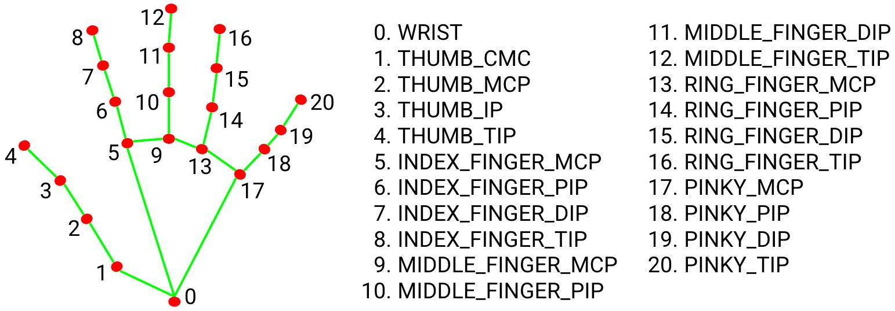

## Introduction

In certain applications requiring hand position or gesture detection, this algorithm can be utilized. It provides:
* Hand position with coordinates for four vertices.
* 3D coordinates of 21 hand keypoints, including depth estimation relative to the palm.

Example applications:
* Touch reading devices
* Gesture control
* Finger-based games
* Sign language translation
* Magic casting simulation

Sample image:


Sample video:
<video playsinline controls autoplay loop muted preload src="/static/video/hands_landmarks.mp4" type="video/mp4">
Classifier Result video
</video>

The 21 keypoints include:


## Using Hand Keypoint Detection in MaixPy MaixCAM

The **MaixPy** platform integrates this algorithm (ported from MediaPipe for ease of use, firmware version **>= 4.9.3** is required). The example can also be found in the [MaixPy/examples](https://github.com/sipeed/maixpy) directory:

```python
from maix import camera, display, image, nn, app

detector = nn.HandLandmarks(model="/root/models/hand_landmarks.mud")
# detector = nn.HandLandmarks(model="/root/models/hand_landmarks_bf16.mud")
landmarks_rel = False

cam = camera.Camera(320, 224, detector.input_format())
disp = display.Display()

while not app.need_exit():
    img = cam.read()
    objs = detector.detect(img, conf_th = 0.7, iou_th = 0.45, conf_th2 = 0.8, landmarks_rel = landmarks_rel)
    for obj in objs:
        # img.draw_rect(obj.x, obj.y, obj.w, obj.h, color = image.COLOR_RED)
        msg = f'{detector.labels[obj.class_id]}: {obj.score:.2f}'
        img.draw_string(obj.points[0], obj.points[1], msg, color = image.COLOR_RED if obj.class_id == 0 else image.COLOR_GREEN, scale = 1.4, thickness = 2)
        detector.draw_hand(img, obj.class_id, obj.points, 4, 10, box=True)
        if landmarks_rel:
            img.draw_rect(0, 0, detector.input_width(detect=False), detector.input_height(detect=False), color = image.COLOR_YELLOW)
            for i in range(21):
                x = obj.points[8 + 21*3 + i * 2]
                y = obj.points[8 + 21** + i * 2 + 1]
                img.draw_circle(x, y, 3, color = image.COLOR_YELLOW)
    disp.show(img)
```

Detection results are visualized using the `draw_hand` function. Keypoint data can be accessed via `obj.points`, providing `4 + 21` points:
* The first 4 points are the bounding box corners in clockwise order: `topleft_x, topleft_y, topright_x, topright_y, bottomright_x, bottomright_y, bottomleft_x, bottomleft_y`. Values may be negative.
* The remaining 21 points are keypoints in the format: `x0, y0, z0, x1, y1, z1, ..., x20, y20, z20`, where `z` represents depth relative to the palm and may also be negative.

Additionally, `obj.x, y, w, h, angle` attributes provide the bounding box and rotation details.

**Precision Optimization**: The `nn.HandLandmarks` class uses an `int8` quantized model by default for faster detection. For higher precision, switch to the `hand_landmarks_bf16.mud` model.
**Relative Landmark Coordinates**: By setting the `landmarks_rel` parameter to `True`, the function will output the 21 keypoints as relative coordinates to the top-left corner of the hand's bounding box. In this case, the last `21x2` values in `obj.points` are arranged as `x0, y0, x1, y1, ..., x20, y20`.

## Advanced: Gesture Recognition Based on Keypoint Detection

### Example: Rock-Paper-Scissors Detection
Two approaches:
1. **Traditional Method**: Use code to classify gestures based on keypoint analysis.
2. **AI Model-Based Method**: Train a classification model.

**Approach 2**:
This involves using the 21 keypoints as input for a classification model. Without image background interference, fewer data samples are needed for effective training.

Steps:
1. Define gesture categories (e.g., rock, paper, scissors).
2. Record keypoint data upon user input.
3. Normalize keypoint coordinates to relative values (0 to object width `obj.w`) using `landmarks_rel` parameter as described above.
4. Collect data for each category.
5. Train a classification model (e.g., using MobileNetV2 in PyTorch).
6. Convert the trained model to MaixCAM-supported format.

This approach requires knowledge of training and quantizing classification models.

## Simplified Model Training Alternative
For users unfamiliar with PyTorch:
1. Generate an image from the 21 keypoints (customize visualization).
2. Upload the images to [MaixHub.com](https://maixhub.com) for model training.
3. Use the trained model in MaixPy for classification.

## Complex Action Recognition
For actions requiring time-series analysis (e.g., circular motions):
* Store keypoint history in a queue for temporal analysis.
* Input historical sequences into a classification model for time-series gesture recognition.
* Alternatively, generate a single image from historical data and classify it.

These methods allow advanced gesture and action recognition leveraging MaixPy's integrated tools.

---

This version includes all details, including the explanation for `landmarks_rel`.

