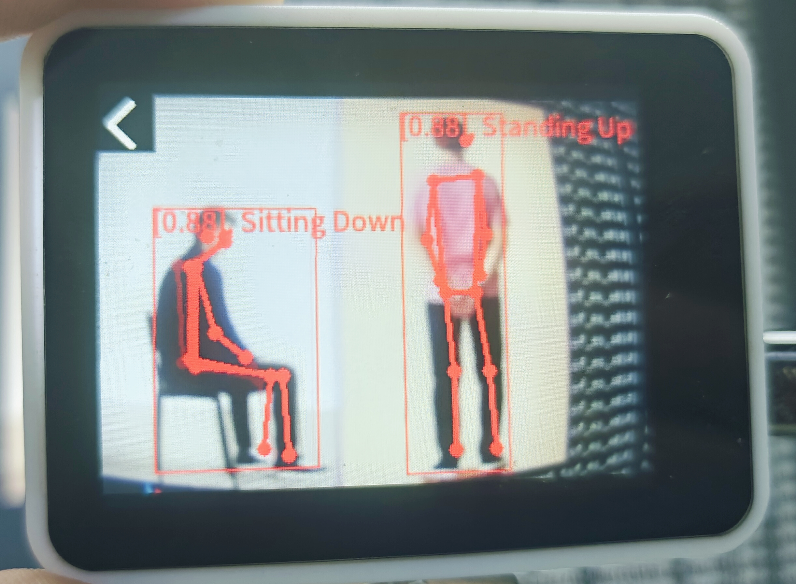

## 简介

由`MaixCAM MaixPy 检测人体关键点姿态检测`可估计人体的 `17` 个关键点。


特定关键点之间的连线可以简单模拟人的肢体，如

```markdown
3-1-0-2-4 构成 头部 (Head)
5-6-12-11-5 构成 躯干 (Torso)
5-7-9 或 6-8-10 构成 上肢 (Upper Limbs)
11-13-15 或 12-14-16 构成 下肢 (Lower Limbs)

"大腿": "Thigh",
"小腿": "Shin",
"大臂": "Upper Arm",
"小臂": "Forearm",
```

每个肢体为一个向量，可由此计算不同肢体间夹角，如

大腿和小腿间夹角，然后可以判断小腿是伸直还是弯曲，且人类不可能在小腿弯曲的情况下直立，以此类推

等等，可对人体的姿态进行初步分类。

当前有以下几个分类：

1. "躺下": "Lying Down",
2. "直立": "Standing Up",
3. "坐下": "Sitting Down",
4. "斜躺": "Reclining",
5. "向左1": "To Left 1",
6. "向右1": "To Right 1",
7. "双手平举": "Both Hands Raised Horizontally",
8. "举左手": "Left Hand Raised",
9. "举右手": "Right Hand Raised",
10. "举双手": "Both Hands Raised Up",
11. "双手比心": "Both Hands Forming a Heart",
12. "大字型": "Big 'T' Shape",


示例图


## 使用

`projects/app_human_pose_classifier/` 打包的 app `Human Pose Classifier` 可直接运行。

`examples/vision/ai_vision/` 下的 `nn_yolo11_pose_cls.py` 是单单文件实现，可以在 MaixVision 直接点击 run 按钮运行。

建议参考 `PoseEstimation.py` 进行定制修改。